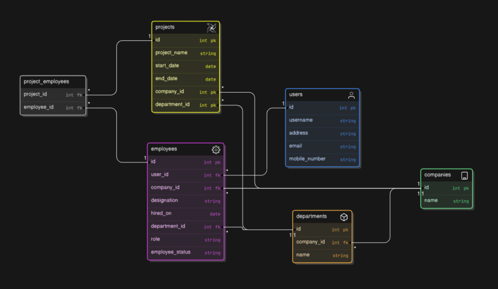

# Employee Management System

Employee Management System API written in Django using Django REST framework

### Setup & Run

```
pip install -r requirements.txt
python manage.py runserver
```

### Authentication

Used Django REST framework's TokenAuthentication

```
headers
Authorization    Token {{token}}
```

### Database



### Requirements

##### 1- Database design (Refer to the diagram above)

- Changed the proposed schema so that username, email, address and phone number are in User model as those are less likely to change and are user-specific

- Moved role to employee model as the values [admin, manager, employee] seem to be company specific as well, the role is then used for authorization and determining who can add, view, edit or delete certain data

##### 2- Validations & Business Logic:

- [x] Validate all required fields are filled
- [x] Validate email addresses and mobile numbers are in the correct format.
- [x] Automatically calculate the number of departments, employees and projects in the company
- [x] Automatically calculate the number of employees and projects in the department
- [x] Automatically calculate the number of assigned projects in the employee
- [x] Automatically calculate the number of days an employee has been with the company based on the hiring
      date
- [x] Ensure that the Department field in Employee and Project models only accepts departments related to
      the selected company.
- [x] Ensure that the Assigned Employees field in Project model only accepts employees related to the
      selected company and department.
- [x] Handle cascading deletions by ensuring either related records are properly managed or preventing the
      deletion if necessary.
- [x] Handle errors and throw appropriate error codes and messages accordingly

##### 3- Workflow:

- [x] Develop a workflow to model the onboarding process for new employees
- [x] Define stages and allowed transitions

##### 4- Security & Permissions:

- [x] Implement role-based access control to ensure:
  - [x] Only authorized personnel can view and edit data.
  - [x] Different roles have different levels of access (e.g., Admin, Manager, Employee).
- [x] Use secure authentication and authorization mechanisms of your choice. (e.g.- Sessions, Tokens).

##### 5- APIs:

- [x] Create a RESTful API that supports all CRUD operations for all models:
- Company
  - [x] GET: Retrieve a single company or list all companies
- Department
  - [x] GET: Retrieve a single department or list all departments
- Employee
  - [x] POST: Create a new employee
  - [x] GET: Retrieve a single employee or list all employees
  - [x] PATCH: Update an existing employee
  - [x] DELETE: Delete an employee
- Project (Bonus)
  - [x] POST: Create a new project
  - [x] GET: Retrieve a single project or list all projects
  - [x] PATCH: Update an existing project
  - [x] DELETE: Delete a project
- [x] Ensure the API handles data securely
- [x] Ensure the API follows RESTful conventions (e.g., using proper HTTP methods like GET, POST, etc.)
- [x] If applicable, provide clear documentation on the API endpoints, parameters and expected responses

##### 6. Testing (Bonus)

##### 7. Logging (Bonus):

- [x] Added a global exception handler that handles all errors without needing to wrap everything on `try/except`, It also logs any errors with their error stack

### Security Measurements

All read operations are public, write, update and delete are only accessible to admins or/and managers of the company, the only exception is for create company, which is public as well

### Postman Documentation

https://documenter.getpostman.com/view/26053493/2sAYHwHj6C

### Key Considerations

- Role is used to determine access level within a company
- Used query annotations, select related and prefetch related to decrease the number of database queries
- Any user can create a company and an employee record will be automatically created for them and they will automatically be assigned to `"{{Company name }}- Main"` Department, this is all done through a transaction


### Potential Improvements
- Add a global App response, that could have keys like status, message, and data to ensure consistency